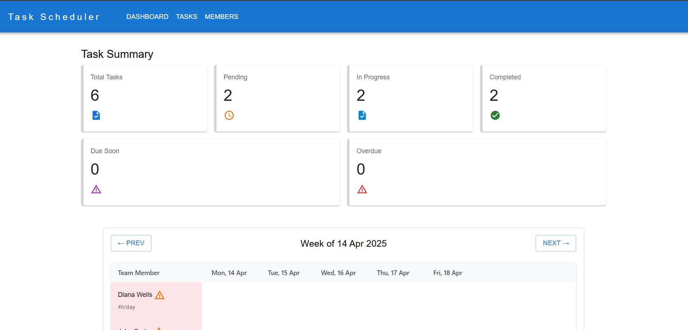
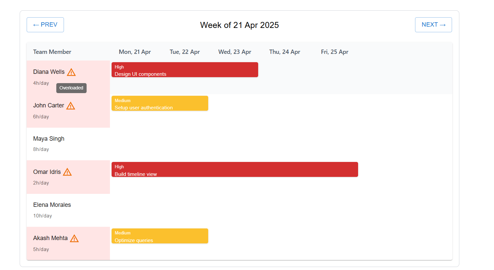
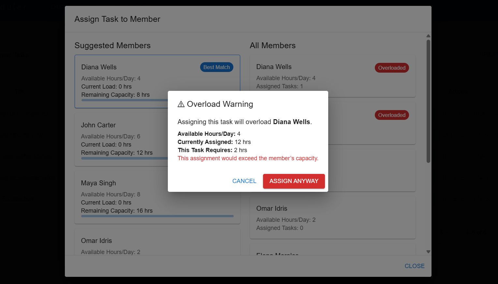

# Task Scheduler – MERN + TypeScript

A task management and scheduling system built using the MERN stack with TypeScript, designed to allocate tasks based on team member availability and workload. The solution is built with scalability in mind — care was taken to structure logic cleanly, manage dependencies responsibly, and define clear types and interfaces for maintainability and future extensibility.

This was implemented using **MongoDB** for storing tasks and members, **Express.js** APIs for business logic, and a **React + TypeScript** frontend with MUI and Tailwind for UI. Form validation is handled using **React Hook Form** and **Yup**.

---

## Setup Instructions

- Clone the repository
    - git clone https://github.com/your-username/task-scheduler.git
    - cd task-scheduler

- Set up .env file
    - cp .env.example .env
    - Open the .env file and replace the placeholder values with your own MongoDB URI

- Backend
    - npm install
    - npm run dev

- Frontend
    - cd frontend
    - npm install
    - npm run dev

- Seeder for demo data
    - node backend/seeders/seedDemoData.js

---

## Features

- Create, update, and delete tasks
- Assign/unassign team members
- Task priority, estimated hours, and deadline
- Assignment suggestions based on workload
- Overload detection and force-assign option
- Track team member capacity and assignments
- Dashboard showing task status breakdown with clickable stats to view tasks in each status category, showing detailed task information.

---

## My Approach

When assigning a task, the system:

- Calculates how many hours each member is already committed to
- Checks member's available hours
- Checks if they can complete the new task before its deadline given their availability
- Suggests a list of best suited members who have enough remaining capacity
- Warns if the assignment would overload the member
- Allows forced assignment with user confirmation

### Planning Process

---

## Project Screenshots

### Dashboard

### Timeline

### Assignment 

---

##  API Endpoints

### Tasks
- `GET /api/v1/tasks` – Get all tasks  
- `POST /api/v1/tasks` – Create a new task  
- `PUT /api/v1/tasks/:id` – Update a task  
- `DELETE /api/v1/tasks/:id` – Delete a task  

### Team Members
- `GET /api/v1/members` – Get all members  
- `POST /api/v1/members` – Create a new member  
- `PUT /api/v1/members/:id` – Update a member  
- `DELETE /api/v1/members/:id` – Delete a member  

### Assignment
- `GET /api/v1/assignment/suggestions/:taskId`  
  → Returns suggested members based on remaining capacity  
- `POST /api/v1/assignment/`  
  → Assign a member to a task (with overload warning)  
- `POST /api/v1/assignment/unassign`  
  → Unassign a member from a task

### Dashboard
- `GET /summary`  
  → Returns summary of task stats with their details

---

## Reflections and Challenges Faced

This project helped me quickly get hands-on with MongoDB, which was new to me and one of the key challenges I encountered. Another challenge was managing time effectively between backend logic and frontend polish — in hindsight, a more strategic split of focus would have allowed deeper refinement of the core task allocation and capacity management logic. Despite that, the project was a valuable learning experience that strengthened my understanding of real-time workload distribution and scalable task assignment systems.

